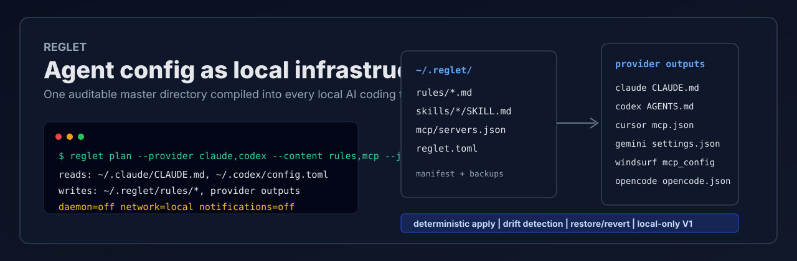
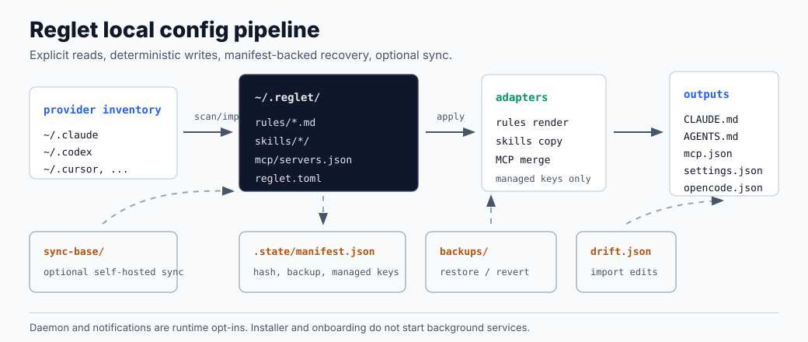

# Reglet



Reglet is a local-first control plane for AI agent configuration. It turns rules, skills, and MCP servers into infrastructure: one versionable master directory, deterministic provider adapters, backups, drift detection, optional daemon apply, and self-hosted sync.

```text
~/.reglet/                 provider outputs
  rules/*.md        -+     ~/.claude/CLAUDE.md
  skills/*/          +-->  ~/.codex/AGENTS.md
  mcp/servers.json  -+     ~/.cursor/mcp.json
  reglet.toml              ~/.gemini/settings.json
                           ~/.codeium/.../mcp_config.json
                           ~/.config/opencode/opencode.json
```

Reglet is built for engineers who treat agent setup as workstation infrastructure, not a hand-copied dotfile habit.

## Status

| Surface | State |
|---|---|
| Master directory | implemented |
| Provider adapters | Claude Code, Codex CLI, Cursor, Gemini CLI, Windsurf, OpenCode |
| Selective onboarding import | implemented |
| Safe apply + backups | implemented |
| Drift detection + import | implemented |
| Restore / revert | implemented |
| Daemon watching | opt-in, implemented |
| Self-hosted sync | implemented |
| Homebrew tap | implemented |
| Mac setup app | implemented, installer blocked on Developer ID |
| Signed/notarized installer | blocked |
| Hosted/team product | roadmap |

## Install

Recommended macOS install:

```bash
brew tap elijahbutler/reglet
brew trust --formula elijahbutler/reglet/reglet
brew install reglet
```

This installs the CLI only. It does not install a daemon, start a background process, configure sync, or write provider files.

GitHub Releases also include raw CLI binaries:

```text
https://github.com/elijahbutler/reglet/releases
```

The native `.pkg` installer path is blocked until Reglet has Apple Developer ID signing and notarization. Unsigned packages are not suitable for broad Mac distribution.

Source checkout:

```bash
git clone https://github.com/elijahbutler/reglet.git
cd reglet
bun install
bun packages/cli/src/index.ts scan
```

## CLI

```bash
# inspect local provider inventory
reglet scan
reglet scan --json

# preview first-run onboarding for setup UIs
reglet plan --provider claude,codex --content rules,mcp --json
reglet plan --provider claude --content skills --skill claude:skill-creator --json

# create ~/.reglet, import selected content, then apply
reglet init
reglet init --provider claude --content skills --skill claude:skill-creator

# compile ~/.reglet into enrolled provider outputs
reglet apply
reglet diff

# detect direct edits to generated files
reglet status --check

# recover from provider writes
reglet restore claude
reglet revert
```

## Safety Invariants

Reglet is conservative because global agent config is operational surface area.

```text
no onboarding       -> no provider writes
no enrollment       -> no daemon
no sync login       -> no sync
no explicit command -> no launchd service
every managed write -> backup + manifest record
```

- Provider paths are backed up before managed writes; Reglet does not snapshot unrelated provider files it will not touch.
- Generated rules files include a Reglet header pointing back to `~/.reglet/`.
- Drift is reported instead of silently overwritten.
- Reglet-owned MCP entries are merged without deleting unmanaged provider keys.
- Daemon execution, macOS notifications, and sync are opt-in.

## System Model



```text
scan/import -> master dir -> provider adapters -> generated outputs
                  ^                    |
                  |                    v
             sync base            drift queue
                  ^                    |
                  └──── restore / import / apply
```

Master directory:

```text
~/.reglet/
|-- rules/                 # canonical agent instructions
|-- skills/                # canonical skill directories
|-- mcp/servers.json       # canonical MCP definitions
|-- reglet.toml            # enrollment and sync config
`-- .state/                # manifest, backups, drift queue, sync cursor
```

## Provider Matrix

| Provider | Rules | Skills | MCP |
|---|---|---|---|
| Claude Code | `~/.claude/CLAUDE.md` | `~/.claude/skills/` | `~/.claude.json` |
| Codex CLI | `~/.codex/AGENTS.md` | `~/.agents/skills/` | `~/.codex/config.toml` |
| Cursor | unsupported global rules | `~/.cursor/skills/` | `~/.cursor/mcp.json` |
| Gemini CLI | `~/.gemini/GEMINI.md` | `~/.gemini/skills/` | `~/.gemini/settings.json` |
| Windsurf | `~/.codeium/windsurf/memories/global_rules.md` | unsupported | `~/.codeium/windsurf/mcp_config.json` |
| OpenCode | `~/.config/opencode/AGENTS.md` | `~/.config/opencode/skills/` | `~/.config/opencode/opencode.json` |

## Packages

```text
packages/core
  config, master dir, manifest, writer
  provider adapters and MCP merges
  apply, drift, import, restore/revert
  sync client and merge engine

packages/cli
  init, scan, plan, apply, diff, status
  enroll, unenroll, import, restore, revert
  login, sync
  daemon run/start/stop/install

packages/server
  Bun + Hono API
  SQLite persistence
  token and account/device modes
  Docker-ready self-hosting

apps/macos/RegletSetup
  SwiftUI first-run setup shell
  consumes scan/plan JSON from the CLI
```

## Self-Hosted Sync

Run a local sync server:

```bash
REGLET_TOKEN=dev-token REGLET_DB=./reglet.sqlite bun packages/server/src/index.ts
```

Connect a client:

```bash
reglet login http://localhost:3000 --token dev-token --device laptop
reglet sync
```

Sync scope is the master directory only: `rules/`, `skills/`, `mcp/servers.json`, and `reglet.toml`. Reglet never syncs `.state/`.

## Development

```bash
bun run typecheck
bun test
bun run lint
bun run build:binaries
bun run build:macos-installer
```

## Docs

- [Installation](docs/installation.md)
- [Usage](docs/usage.md)
- [Architecture](docs/architecture.md)
- [Providers](docs/providers.md)
- [Self-hosting](docs/self-hosting.md)
- [Development](docs/development.md)
- [Roadmap](ROADMAP.md)

## License

MIT
